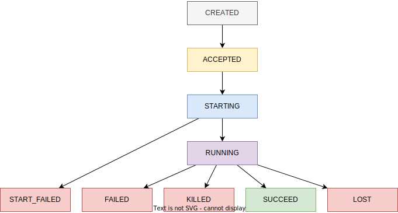

# 总体架构

## 服务说明

### maple-restful-api 入口服务

用于接收任务请求

### maple-scheduler 调度器

用于消费和管理任务

### maple-execution-manager 执行管理器

负责引擎的创建，任务执行

### maple-persistence-service 持久化服务

用于数据库访问

## 引擎执行

### 执行状态

- CREATED:       新建任务，刚存储到数据库
- ACCEPTED:      添加系统队列
- STARTING:      提交集群/开始启动
- START_FAILED:  提交集群失败/启动失败
- RUNNING:       运行中
- SUCCEED:       运行成功
- FAILED:        运行失败
- KILLED:        强制杀死
- CANCELED:      作业停止/取消
- UNKNOWN:       未知

**状态流转**

 

## 用户请求任务

请求信息包括：请求唯一ID、group、user、对接应用、作业类型、请求描述，请求类型，执行类型，webhook(回调地址)

### 执行流程


1. 用户发起引擎执行作业请求

2. 添加作业状态为 SUBMITTED

   1. 将作业信息存储到数据库，获取到作业ID

   2. 将作业ID添加到Redis队列，队列标识：cluster + queue + 来源应用 + group + 优先级，例：hadoop-root.default-schedule-maple-1，修改作业状态为 ACCEPTED

3. scheduler 持续消费 redis 队列，根据作业ID拿到执行详细信息

4. scheduler 将执行请求发送到 execution-manager，修改作业状态为 STARTING

5. execution-manager 根据引擎的类型，加载对应插件，获取到执行命令生成对象（包括模板地址，输出文件地址，模板数据对象）

6. execution-manager 根据执行命令生成对象，

   1. YARN 生成对应的脚本，并启动

   2. K8s 生成对应的 yaml 文件，并调用 Scheduler 服务提交

如果启动失败，由 execution-manager 将作业状态更新为 START_FAILED（发送请求到 persistence-service，persistence-service 判断作业状态为 STARTING 时才更新）

引擎启动后自己回写状态，同时由 scheduler 监控状态

   1. YARN 类型的任务由 scheduler 定时获取结束的任务，修改作业状态为对应的结束状态

   2. K8s 类型的任务由 scheduler 通过 informer list-watch 机制，实时修改作业状态

启动完成后修改状态为 RUNNING

运行成功后，修改状态为 SUCCEED

运行失败后，修改状态为 FAILED

调用 scheduler kill 引擎，修改状态为 KILLED

# 数据库设计

## 作业表

```mysql

drop table if exists `maple`.`maple_engine_execution`;
create table `maple`.`maple_engine_execution`

(
    `id`              int                                    not null auto_increment comment '执行ID',
    `unique_id`       varchar(32)                            not null comment '执行标识',
    `exec_name`       varchar(32)  default ''                not null comment '执行名称',
    `exec_comment`    varchar(256) default ''                not null comment '作业说明',
    `content_type`    varchar(8)   default 'text'            not null comment '执行内容类型 (text, path)',
    `content_path`    varchar(256) default ''                not null comment '执行内容路径',
    `from_app`        varchar(16)                            not null comment '来源应用',
    `cluster`         varchar(32)                            not null comment '提交集群',
    `cluster_queue`   varchar(128) default ''                not null comment '集群队列',
    `engine_category` varchar(16)  default ''                not null comment '引擎种类',
    `engine_version`  varchar(16)  default ''                not null comment '引擎版本',
    `priority`        tinyint                                not null comment '初始优先级',
    `run_pri`         tinyint                                not null comment '运行优先级',
    `pri_upgradable`  bit          default 0                 not null comment '优先级是否可升级',
    `status`          varchar(16)  default 'CREATED'         not null comment '状态 (CREATED, ACCEPTED, STARTING, START_FAILED, RUNNING, SUCCEED, FAILED, KILLED, CANCELED, LOST, UNKNOWN)',
    `group`           varchar(32)  default ''                not null comment '用户组',
    `user`            varchar(32)  default ''                not null comment '用户',

    `starting_time`   datetime                               null comment '任务提交时间',     -- 对应 STARTING 的时间
    `running_time`    datetime                               null comment '任务执行开始时间', -- 对应首次 RUNNING 的时间
    `finish_time`     datetime                               null comment '任务执行结束时间', -- 对应结束状态的时间
    `create_time`     datetime     default current_timestamp not null comment '创建时间',
    `update_time`     datetime     default current_timestamp not null on update current_timestamp comment '更新时间',

    primary key (`id`),
    unique uniq_exec_unique_id (`unique_id`),
    index idx_exec_name (`exec_name`),
    index idx_exec_from_app (`from_app`),
    index idx_exec_cluster_queue (`cluster`, `cluster_queue`),
    index idx_exec_engine (`engine_category`, `engine_version`),
    index idx_exec_status (`status`),
    index idx_exec_group (`group`),
    index idx_exec_user (`user`)
) engine = InnoDB
  default charset = utf8
  collate = utf8_unicode_ci
    comment = '引擎执行记录';

drop table if exists `maple`.maple_engine_execution_ext_info;
create table `maple`.`maple_engine_execution_ext_info`
(
    `id`            int        not null comment '执行ID',
    `exec_content`  mediumtext null comment '执行内容',
    `configuration` text       null comment '作业配置',
    `ext_info`      text       null comment '扩展信息',
    `exec_info`  text       null comment '执行信息',
    primary key (`id`)
) engine = InnoDB
  default charset = utf8
  collate = utf8_unicode_ci
    comment = '引擎执行扩展信息';
```

- exec_content: 作业执行的内容，包括 python/sql/scala 等

  
- configuration: 作业的配置信息，json 字符串

  
- ext_info: 作业的扩展信息，todo

  
- exec_info: 作业的执行信息，todo

YARN

```json
{
  "lastStatus": "",
  "startInfo": {
    "statuses": [
      {
        "code": "",
        "status": "",
        "message": "",
        "time": ""
      }
    ]
  },
  "lastClusterStatus": "",
  "clusterInfo": {
    "statuses": [
      {
        "code": "",
        "status": "",
        "time": ""
      }
    ],
    "resources": {
      "memory": "",
      "cores": ""
    },
    "detail": {
      // map
    }
  },
  "rawStatus": "",
  "rawInfo": {
    "statuses": [
      {
        "code": "",
        "status": "",
        "time": ""
      }
    ]
  }
}
```

K8s

```json
{
  "lastStatus": "",
  "startInfo": {
    "statuses": [
      {
        "code": "",
        "status": "",
        "message": "",
        "time": ""
      }
    ]
  },
  "lastClusterStatus": "",
  "clusterInfo": {
    "statuses": [
      {
        "code": "",
        "status": "",
        "time": ""
      }
    ],
    "resources": {
      "memory": "",
      "cores": ""
    },
    "detail": {
      // map
    }
  }
}
```

  
# 作业配置

## spark

```json
{
   "driverCores": "",
   "driverMemory": "",
   "numExecutors": "",
   "executorCores": "",
   "executorMemory": "",
   "driverJavaOptions": "",
   "driverClassPath": "",
   "jars": "",
   "files": "",
   "archives": "",
   "conf": {
   },
   "runType": "data_calc",
   "jobConf": {
      "mainFile": ""
   },
   "runType": "sql",
   "jobConf": {
      "mainFile": ""
   },
   "runType": "scala",
   "jobConf": {
      "mainFile": ""
   },
   "runType": "py",
   "jobConf": {
      "pyFiles": "",    // 第三方库，你可以将它们打包成 .zip、.egg 或 .whl 文件
      "mainFile": "",
      "args": ""
   },
   "runType": "jar",
   "jobConf": {
      "mainFile": "",
      "mainClass": "",
      "args": ""
   }
}
```

## flink

```json
{
   "runType": "data_calc",
   "jobConf": {
      "mainFile": ""
   },
   "runType": "sql",
   "jobConf": {
      "mainFile": ""
   },
   "runType": "scala",
   "jobConf": {
      "mainFile": ""
   },
   "runType": "py",
   "jobConf": {
      "pyFiles": "",    // 第三方库，你可以将它们打包成 .zip、.egg 或 .whl 文件
      "mainFile": "",
      "args": ""
   },
   "runType": "jar",
   "jobConf": {
      "mainFile": "",
      "mainClass": "",
      "args": ""
   }
}
```

生成对象：

```json
{
   "mapleId": "1",
   "execName": "xxx_sync_task",
   "fromApp": "schedule",
   "queue": "default",
   "group": "",
   "user": "",
   "job": {} // 上面的作业配置
}
```


# YARN

# 作业返回详情
