# 项目说明

## 整体设计



## 调用样例

```
spark-submit \
    --master local[*] \
    --name maple-data-calc \
    --conf spark.testing.memory=2148480000 \
    --conf driver-memory=1g \
    --conf executor-memory=1500m \
    --conf num-executors=2 \
    --conf executor-cores=2 \
    --conf queue=default \
    --conf spark.sql.catalogImplementation=hive \
    --conf spark.rpc.message.maxSize=2047 \
    --conf spark.executor.memoryOverhead=2048 \
    --conf spark.kryoserializer.buffer.max=2047m \
    --conf spark.driver.maxResultSize=2g \
    --conf spark.sql.parquet.writeLegacyFormat=true \
    --conf spark.sql.crossJoin.enabled=true \
    --conf spark.sql.codegen.wholeStage=false \
    --conf spark.sql.warehouse.dir=/apps/hive/warehouse \
    --conf hive.metastore.uris=thrift://hive-meta-01:9083,thrift://hive-meta-02:9083 \
    --conf hive.exec.dynamic.partition=true \
    --conf hive.exec.dynamic.partition.mode=nonstrict \
    --class org.xi.maple.MapleApp maple.jar -f maple/examples/data-array.json --exec-type array
```

## 配置文件内容

有两种配置模式：数组模式和分组模式，默认为数组模式

### 数组模式

```json
{
    "variables": {
    },
    "plugins": [
        {
            "type": "source",
            "name": "jdbc",
            "config": {
                "resultTable": "spark_000021",
                "url": "jdbc:mysql://localhost:3306/",
                "driver": "com.mysql.cj.jdbc.Driver",
                "user": "xi_root",
                "password": "123456",
                "query": "select * from linkis.linkis_cg_manager_label",
                "options": {
                }
            }
        },
        {
            "type": "transformation",
            "name": "sql",
            "config": {
                "resultTable": "spark_00003",
                "sql": "select * from spark_000021 limit 100"
            }
        },
        {
            "type": "sink",
            "name": "file",
            "config": {
                "sourceTable": "spark_00003",
                "path": "hdfs:///tmp/data/testjson",
                "serializer": "json",
                "partitionBy": [
                    "label_key"
                ],
                "saveMode": "overwrite"
            }
        }
    ]
}

```

插件有两个字段，name 为插件名，type 为插件类型（source，transformation，sink），config 为具体配置

### 分组模式

```json
{
    "variables": {
    },
    "sources": [
        {
            "name": "jdbc",
            "config": {
                "resultTable": "spark_00001",
                "url": "jdbc:mysql://localhost:3306/",
                "driver": "com.mysql.cj.jdbc.Driver",
                "user": "xi_root",
                "password": "123456",
                "query": "select * from linkis.linkis_cg_manager_label",
                "options": {
                }
            }
        }
    ],
    "transformations": [
        {
            "name": "sql",
            "config": {
                "resultTable": "spark_00002",
                "sql": "select * from spark_00001 where create_time > '2021-08-30' limit 100"
            }
        }
    ],
    "sinks": [
        {
            "name": "file",
            "config": {
                "sourceTable": "spark_00002",
                "path": "hdfs:///tmp/data/testjson",
                "serializer": "json",
                "partitionBy": [
                    "label_key"
                ],
                "saveMode": "overwrite"
            }
        }
    ]
}
```

插件有两个字段，name 为插件名，config 为具体配置

配置分为**3部分**：

1. sources

   配置数据源，对应source类型插件

2. transformations

   配置具体操作，对应transform类型插件

3. sinks

   配置输出操作，对应sink类型插件

### 插件说明

#### Source 插件配置

对应数据读取操作，可以从文件，jdbc读取文件

##### 公共配置

| **字段名**   | **说明**                                                     | **字段类型**        | **是否必须** | **默认值**      |
| ------------ | ------------------------------------------------------------ | ------------------- | ------------ | --------------- |
| resultTable  | 注册表名，供 transform / sink 使用                           | String              | 是           | -               |
| persist      | 是否缓存                                                     | Boolean             | 否           | false           |
| storageLevel | 缓存级别                                                     | String              | 否           | MEMORY_AND_DISK |
| options      | 参考 [spark 官方文档](https://spark.apache.org/docs/latest/sql-data-sources.html) | Map<String, String> | 否           |                 |

##### file

**配置字段**

| **字段名**  | **说明**                 | **字段类型** | **是否必须** | **默认值** |
| ----------- | ------------------------ | ------------ | ------------ | ---------- |
| path        | 文件路径，默认为 hdfs    | String       | 是           | -          |
| serializer  | 文件格式，默认为 parquet | String       | 是           | parquet    |
| columnNames | 映射的字段名             | String[]     | 否           | -          |

**样例**

```JSON
{
    "name": "file",
    "config": {
        "resultTable": "spark_source_table_00001",
        "path": "hdfs:///data/ods/xishihao/testjson/xxx.csv",
        "serializer": "json",
        "columnNames": ["id", "name"],
        "options": {
            "key": "value"
        }
    }
}
```

##### jdbc

**配置字段**

| **字段名** | **说明**                                             | **字段类型** | **是否必须** | **默认值** |
| ---------- | ---------------------------------------------------- | ------------ | ------------ | ---------- |
| url        | 元数据中的数据库别名                                 | String       | 是           | -          |
| driver     | 驱动类（完全限定名）                                 | String       | 是           | -          |
| user       | 用户名                                               | String       | 是           | -          |
| password   | 密码                                                 | String       | 是           | -          |
| query      | 查询语句，查询中使用的函数必须符合选中的数据库的规范 | String       | 是           | -          |

**样例**

```JSON
{
    "name": "jdbc",
    "config": {
        "resultTable": "spark_source_table_00001",
        "url": "jdbc:mysql://localhost:3306/",
        "driver": "com.mysql.cj.jdbc.Driver",
        "user": "local_root",
        "password": "123456",
        "query": "select a.xxx, b.xxxx from table where id > 100",
        "options": {
            "key": "value"
        }
    }
}
```

#### Transform 插件配置

数据加工相关逻辑

##### 公共配置

| **字段名**   | **说明**                                       | **字段类型** | **是否必须** | **默认值**      |
| ------------ | ---------------------------------------------- | ------------ | ------------ | --------------- |
| sourceTable  | 来源表名，使用 source / transform 注册的结果表 | String       | 否           | -               |
| resultTable  | 注册表名，供 transform / sink 使用             | String       | 是           | -               |
| persist      | 是否缓存                                       | Boolean      | 否           | false           |
| storageLevel | 缓存级别                                       | String       | 否           | MEMORY_AND_DISK |

##### sql

**配置字段**

| **字段名** | **说明**                                                     | **字段类型** | **是否必须** | **默认值** |
| ---------- | ------------------------------------------------------------ | ------------ | ------------ | ---------- |
| sql        | 查询的 sql，可以使用前面 sosurces 和 transformations 中的注册表名 | String       | 是           | -          |

**样例**

```JSON
{
    "name": "sql",
    "config": {
        "resultTable": "spark_transform_table_00001",
        "sql": "select * from ods.car_order as a join spark_source_table_00001 as b on a.vin=b.vin",
        "cache": true
    }
}
```

#### Sink 插件配置

可以把结果写入到文件或者表

##### 公共变量

| **字段名**                | **说明**                                                     | **字段类型**        | **是否必须** | **默认值**                                                   |
| ------------------------- | ------------------------------------------------------------ | ------------------- | ------------ | ------------------------------------------------------------ |
| sourceTable / sourceQuery | transform 中的结果表名或者查询的sql语句 作为结果输出         | String              | 否           | sourceTable 和 sourceQuery 必须有一个不为空 sourceQuery 优先级更高 默认为最后一个 transform |
| options                   | 参考 [spark 官方文档](https://spark.apache.org/docs/latest/sql-data-sources.html) | Map<String, String> | 否           |                                                              |
| variables                 | 变量替换，类似 dt="${day}"                                   | Map<String, String> | 否           | {    "dt": "${day}",     "hour": "${hour}", }                |

##### hive

**配置字段**

| **字段名**     | **说明**                                                     | **字段类型** | **是否必须** | **默认值** |
| -------------- | ------------------------------------------------------------ | ------------ | ------------ | ---------- |
| targetDatabase | 待写入数据的表所在的数据库                                   | String       | 是           | -          |
| targetTable    | 待写入数据的表                                               | String       | 是           | -          |
| saveMode       | 写入模式，参考 spark，默认为 overwrite                       | String       | 是           | parquet    |
| strongCheck    | 强校验，字段名，字段顺序，字段类型必须一致                   | Boolean      | 否           | true       |
| writeAsFile    | 按文件方式写入，可以提高效率，此时 variables 中必须包含所有的分区变量 | Boolean      | 否           | false      |
| numPartitions  | 分区个数，Dataset.repartition                                | Integer      | 否           | 10         |

**样例**

```JSON
{
    "name": "hive",
    "config": {
        "sourceTable": "spark_transform_table_00001",
        "targetTable": "dw.result_table",
        "saveMode": "append",
        "options": {
            "key": "value"
        }
    }
}
```

#####  jdbc

**配置字段**

| **字段名**     | **说明**                   | **字段类型** | **是否必须** | **默认值** |
| -------------- | -------------------------- | ------------ | ------------ | ---------- |
| url            | 元数据中的数据库别名       | String       | 是           | -          |
| driver         | 驱动类（完全限定名）       | String       | 是           | -          |
| user           | 用户名                     | String       | 是           | -          |
| password       | 密码                       | String       | 是           | -          |
| targetDatabase | 待写入数据的表所在的数据库 | String       | 否           | -          |
| targetTable    | 待写入数据的表             | String       | 是           | -          |
| preQueries     | 写入前执行的sql语句        | String[]     | 否           | -          |

**样例**

```JSON
{
    "name": "jdbc",
    "config": {
        "sourceTable": "spark_transform_table_00001",
        "database": "test",
        "targetTable": "test_001",
        "preQueries": ["delete from test_001 where dt='${day}'"],
        "options": {
            "key": "value"
        }
    }
}
```

##### file

**配置字段**

| **字段名**  | **说明**                               | **字段类型** | **是否必须** | **默认值** |
| ----------- | -------------------------------------- | ------------ | ------------ | ---------- |
| path        | 文件路径，默认为 hdfs                  | String       | 是           | -          |
| serializer  | 文件格式，默认为 parquet               | String       | 是           | parquet    |
| partitionBy |                                        | String[]     | 否           |            |
| saveMode    | 写入模式，参考 spark，默认为 overwrite | String       | 否           |            |

**样例**

```JSON
{
    "name": "file",
    "config": {
        "sourceTable": "spark_transform_table_00001",
        "path": "hdfs:///data/ods/xishihao/testjson/",
        "serializer": "json", 
        "variables": {
            "key": "value"
        },
        "options": {
            "key": "value"
        }
    }
}
```